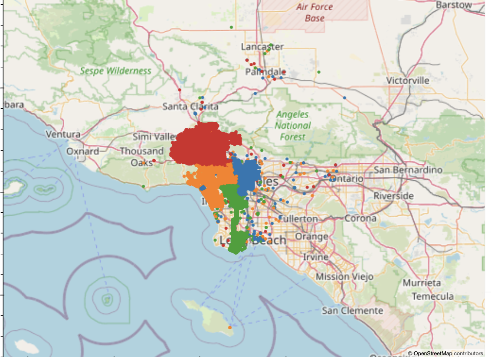

 Project-1: The Effect of COVID on Crime in the City of Los Angeles

The goal of this project was to determine the potential effects of the Covid-19 pandemic on crime in the city of Los Angeles
Research Questions:
1.	Was overall crime lower during the Covid-19 pandemic?
2.	Did crime shift by bureau over time?
3.	Did the pandemic affect the number of victims by gender?
4.	Was there was an increase in domestic violence and child abuse?

Methodology:
Data Set: City of LA Crime Dataset 2010 – 2019 and 2020-Present
Analyzed data in two stages: 
Stage One: Focused on the total number crimes reported, crimes reported in different areas
Stage Two: Focused on the race and/or ethnicity of the victims, a subset of the type of crime reported, and the gender of the victims
Hypothesis and Null Hypothesis:
Null Hypothesis
•	Overall Crime: Covid-19 did not have a significant effect on crime in Los Angeles
•	By Bureau: Covid-19 did not have a significant effect on crime in each area of Los Angeles
•	By Gender: Covid-19 did not have a significant effect on the victim gender
•	By Type: Covid-19 did not have a significant effect on domestic violence and child abuse

Alternate Hypothesis
•	Overall Crime: Covid-19 did have a significant effect on crime in Los Angeles
•	By Bureau: Covid-19 did have a significant effect on crime in each area of Los Angeles
•	By Gender: Covid-19 did have a significant effect on the victim gender
•	By Type: Covid-19 did have a significant effect on domestic violence and child abuse

Data Cleaning

1. Concatenated the two data sets

2. Created a “Crime Year” column to analyze crime by year
   

3. Removed unused columns
   

4. Removed NULL entries
   

5. Removed duplicate crime records
    

6. Removed unrecorded victim age data
    

7. Renamed columns
    

8. Removed coordinates outside of the City of Los Angeles

________________________________________________________________________________________________________

                           Crime Summary 

Created a Summary Statistics table of the total crimes over the entire dataset
Bar plot of the total crime count over the length of the dataset
   

Line graph showing the percentage change in total crimes year-to-year

Linear Regression plot

T-Test of Pre-Covid and Post-Covid Yearly Total Crimes by slicing the data.

                    Area Summary

1.  We selected all of the different Areas .
2. Placed all areas in four bins: Central, South, West, Valley. 
3. Pre Covid Data
   a: filter your DataFrame to include only the data for the years 2010 to 2019 and grouped by Area Name and Crime Year.
   b: Then group it by Area Name and calcuate the mean.  
4. Covid Data 
   a: Did same thing with data for 2020 to 2023  

5. Plotted a Bar Graph               

6. Using the geoapify API made the maps for Hot Spots for Pre Covid Data and Covid Data

[https://api.geoapify.com/v2/places](https://api.geoapify.com/v2/places)

  

7. Merged the data of Area Name/ Pre Covid Years/ Mean Data and Area Name/ Covid Years/ Mean Data

8.Used Chi Square to calculate the p value#Merged the data of Area Name/ Pre Covid Years/ Mean Data and Area Name/ Covid Years/ Mean Data 

### Null Hypothesis : There is no statiscal difference between two datas
### Hypothesis: There is a statiscally significant difference.

                        Types of Crimes Gender Summary
 Counted all of the unique values in 'Types of Crime' column                     
#find all the unique values in 'Types of Crime' column
Defined different categories
 Listed all crime descriptions
 Categorize each crime description
Plotted a pie Chart
