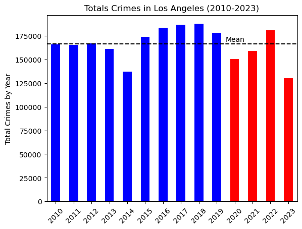

 # Project-1
## The Effect of COVID on Crime in the City of Los Angeles

### Objective
The goal of this project was to determine the potential effects of the Covid-19 pandemic on crime in the city of Los Angeles
________________________________________________________________________________________________________
### Research Questions:
1. Did the Covid-19 pandemic have a significant impact on overall crime?
2. Did crime shift by bureau over time?
3.	Did the pandemic affect the number of victims by gender?
4.	Was there was an increase in domestic violence and child abuse?
________________________________________________________________________________________________________
### Methodology:
Our analysis sources two datasets of every crime incident from the Los Angeles Police Department, from 2010-2019 and 2020-2023, respectively.
These records were transcribed from handwritten and typed police reports, and have the potential for inaccuracies.
Our assumption for this project was that the Covid-19 era took place from the 2020-2023
After collecting and concatenating the datasets into one comprehensive dataframe, the columns were reduced to the information that helped 
________________________________________________________________________________________________________
### Hypothesis and Null Hypothesis:

#### Null Hypothesis
Annual Crime: Covid-19 did not have a significant effect on crime in Los Angeles
 By Bureau: Covid-19 did not have a significant effect on crime in each area of Los Angeles
 By Gender: Covid-19 did not have a significant effect on the victim gender
 By Type: Covid-19 did not have a significant effect on domestic violence and child abuse

#### Alternate Hypothesis
Overall Crime: Covid-19 did have a significant effect on crime in Los Angeles
 By Bureau: Covid-19 did have a significant effect on crime in each area of Los Angeles
 By Gender: Covid-19 did have a significant effect on the victim gender
 By Type: Covid-19 did have a significant effect on domestic violence and child abuse
________________________________________________________________________________________________________
### Data Cleaning

1. Concatenated the two data sets

2. Created a “Crime Year” column to analyze crime by year
   

3. Removed unused columns
   

4. Removed NULL entries
   

5. Removed duplicate crime records
    

6. Removed unrecorded victim age data
    

7. Renamed columns
    

8. Removed coordinates outside of the City of Los Angeles

________________________________________________________________________________________________________

### Annual Crime Summary 

#### This analysis comprised of multiple steps:
  - Created a new dataframe the total number of crimes indexed by the year
  - Percentage Change per year was calculated and added to the new dataframe
  - A Summary Statistics table was generated
  - IQR, upper and lower bounds were calculated to confirm that there were no outliers
  - Created an Annual Crime Summary dataframe consisting of the most common occurring data from each of our columns indexed by year
  - Plotted a bar graph of the Total Crimes by Year (with the mean visible)
  - Plotted a line graph of the Percentage Change by Year
  - Plotted a linear regression of the Total Crimes by Year
  - Ran a T-Test of Pre-Covid and Covid-Era Yearly Total Crimes by slicing the data.
      

#### Output Data
 

#### Results:
  - There were no statistical outliers in the Annual Total Crimes data
  - Three out of the Four Covid-Era years were below the mean of the entire 14 year period in the dataset
  - The Percentage Change analysis showed that very similar decreases in total crime occurred in 2014 and 2020
  - The linear regression produced an r-value of 0.0095, showing a weak linear relationship of total crimes over the years
  - The Annual Crime Summary showed that with further research, Hispanic Victim Data and Single Family Dwellings have the potential to be key indicators in grasping the total crime in Los Angeles
  - The T-Test calculated a p-value of 0.2469, which shows that, while the Covid-Era mean was 155124 compared to Pre-Covid mean of 170625 the difference between the Covid-Era and Pre-Covid means do not have a statisically significant difference between them
  - Overall, the Annual Crime Analysis was an exercise in how visualizing statistical differences does not imply statistical significance, as the total crimes committed during the Covid-Era were undoubtedly lower than Pre-Covid
________________________________________________________________________________________________________

### Area Summary

1. We selected all of the different Areas.
2. Placed all areas in four bins: Central, South, West, Valley. 
3. Pre Covid Data: Filter your DataFrame to include only the data for the years 2010 to 2019 and grouped by Area Name and Crime Year. Then group it by Area Name and calcuate the mean.  
4. Covid Data - Did same thing with data for 2020 to 2023  
5. Plotted a Bar Graph               
6. Using the geoapify API made the maps for Hot Spots for Pre Covid Data and Covid Data
7. Merged the data of Area Name / Pre Covid Years / Mean Data and Area Name / Covid Years / Mean Data
8. Used Chi Square to calculate the p value, merged the data of Area Name / Pre Covid Years / Mean Data and Area Name / Covid Years / Mean Data

#### Output Data

  

#### Null Hypothesis: There is no statiscal difference between two datas
#### Hypothesis: There is a statiscally significant difference.
________________________________________________________________________________________________________
### Types of Crimes Gender Summary
 - Counted all of the unique values in 'Types of Crime' column                     
 - Find all the unique values in 'Types of Crime' column
 - Defined different categories
 - Listed all crime descriptions
 - Categorize each crime description
 - Plotted a pie Chart
________________________________________________________________________________________________________
### Victim Race 

Total Crimes were the highest for Hispanic Victims. As the graph trends for hispanics is similar to total annual percentage change in total crimes, looking at the crime trends can be a good indication for LA crimes trends. During COVID the total crimes significantly decreased which can be attributed to COVID restrictions.
________________________________________________________________________________________________________
### Limitations
 - Our Data was compiled from from hand written reports
 - Our assumption: COVID-19 era was in 2020-2023
 - Reduction in total crime in 2023 can be partially attributed to a truncated collection of data
 - We did not have a key or legend to understand some of the data, like X for Gender, ages <= 0, and etc
 - Some of the longitude and latitude entries incorrect.
 - Perpetrator information was not included
________________________________________________________________________________________________________
### Conclusions
Annual Crime: Covid-19 did not have a significant effect on annual crime in Los Angeles
 By Bureau: Covid-19 crime numbers were statistically significantly different than Pre Covid Crime numbers in Four Bureaus of Los Angeles
 By Gender: Covid-19 did not have a significant effect on the victim gender
 By Type: Covid-19 effect on domestic violence and child abuse was not conclusive
________________________________________________________________________________________________________
### Attributions
Dataset via Data.Gov as per the Los Angeles Police Department: https://catalog.data.gov/dataset/crime-data-from-2010-to-2019/resource/7019ef5a-a383-479c-8a28-8175ced9b7f5
  Dataset via Data.LaCity.org as per the Los Angeles Police Department: https://data.lacity.org/Public-Safety/Crime-Data-from-2020-to-Present/2nrs-mtv8
  Geoapify API: https://api.geoapify.com/v2/places
________________________________________________________________________________________________________
### Presentation
https://docs.google.com/presentation/d/1YFpqs_BVtB2oGz-y_qd-PSIuLjoewpZu8ZZBFE_BbJM/edit?usp=sharing

